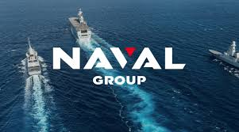
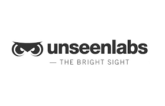
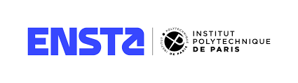
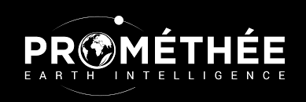

# HACKATHON SPASEA - Surveillance Maritime Augmentée par IA Agentique grâce aux données satellitaires

> [!NOTE]
> 
> Les données ne sont pas en open source par soucis de confidentialité.

## Objectifs

> Apporter un avantage stratégique et tactique aux forces Marines Françaises à l’aide d’IA et de données satellites. 

> Développer un chatbot et une interface graphique permettant de donner au marin une description de sa situation (navires suspects autour de lui avec un score, raisons des suspicions ...)  

Ce Hackathon a été réalisé en 28h en équipe de 6.

## Notions abordées
* **Gestion de projet :** répartition des tâches, plannification, prise de décisions.

* **Acquisition de Données :** Connexion et téléchargement de données parquets depuis la plateforme DAWEX (AIS, RF, Éphémérides).

* **Cartographie Interactive (Folium) :** Affichage de millions de positions de navires avec **clustering intelligent**.

* **Filtrage Avancé :** Filtrage en temps réel par type de navire, pavillon (Pays), et date.

* **Analyse de Suspicions :** Calcul de scores de suspicion basés sur les coupures AIS, l'erraticité des trajectoires et le l'existence de doublons de MMSI.

* **Animation de Trajectoire :** Visualisation animée de l'itinéraire historique complet d'un ou plusieurs navires avec contrôle de timeline.

* **Agent IA (NavalBot) :** Un agent conversationnel basé sur LangChain/LangGraph, capable d'utiliser un ensemble d'outils spécialisés pour interroger, croiser et analyser les données AIS, RF et satellites sur demande.

## Prérequis

* Un environnement Python 3.9+ (recommandé : Google Colab ou Jupyter Lab ).
* Accès Internet et comptes pour les APIs (OpenRouter, OpenWeather, EMODnet) et les téléchargements DAWEX.

## Auteurs:
* François-Xavier COLLOT
* Louise DELFOSSE
* Pierre-Antoine HIGNARD
* Marin HEROGUER
* Samuel VATON

## Partenaires:
Ce projet a été développé en partenariat avec les organisations suivantes, exploitant leurs données et expertises:
* Naval Group (organisateur)
* DGA
* CNES
* UNSEENLABS
* DAWEX
* ENSTA
* PROMÉTHÉE

<!-- 
 -->

